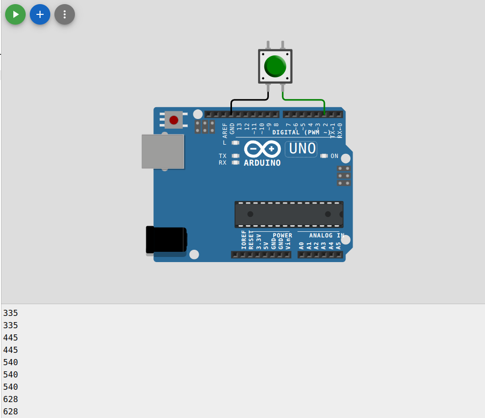
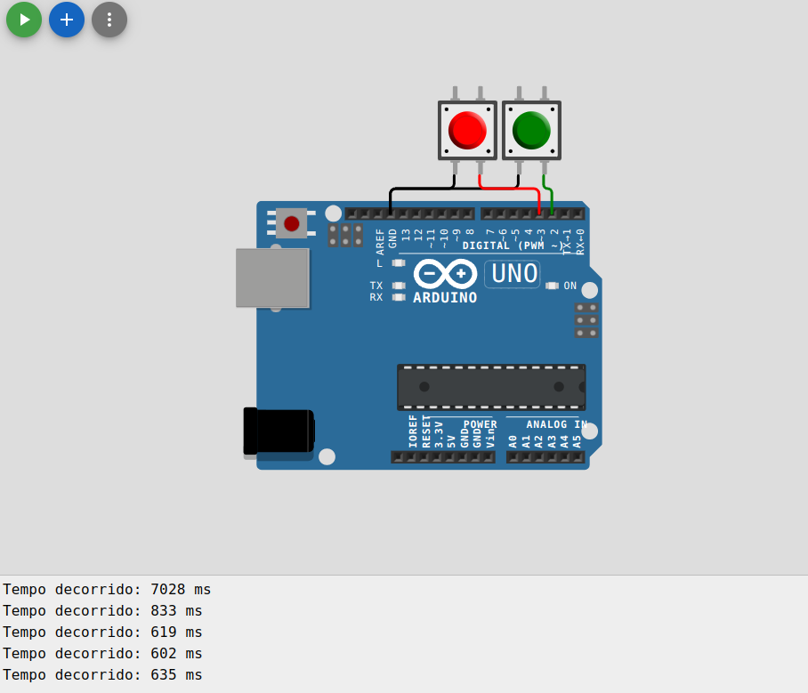
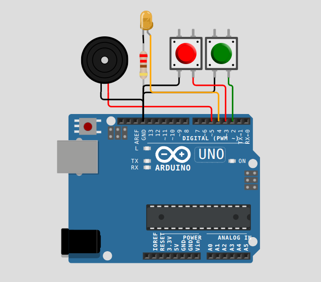
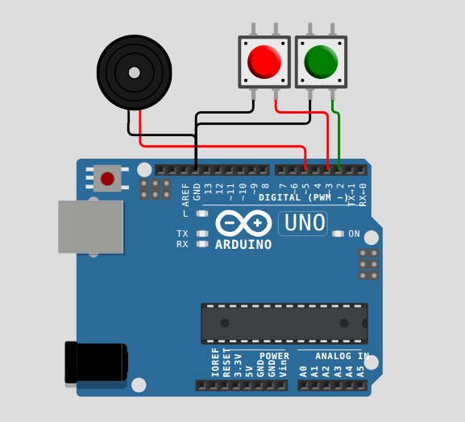

<div align="center" style="display: inline_block">
  
  
  
</div>

<br>
<div align="center">
  
<table>
<thead>
  <tr>
    <td rowspan="3"></td>
    <td>Professor: Diego Ascanio</td>
    <td>Disciplina: Lab. de Micro</td>
  </tr>
    <tr>
      <td>Aluno: <code>Celso Vinícius Sudário</code></td>
      <td>Matrícula: <code>20203003611</code></td>
    <!-- </tr>
      <tr>
      <td>Aluno: <code>Pedro H. Pires Dias</code></td>
      <td>Matrícula: <code>00000000000</code></td>
    </tr> -->
</thead>
</table>

</div>

## Exercício 1

<div align="justify">

**Contador de Interrupções Externas**.

Objetivo: Crie um programa que use uma interrupção externa para contar o número de vezes que um botão é pressionado.

Detalhes: O contador deve ser incrementado a cada pressionamento de botão e o valor atual deve ser exibido no Serial Monitor. Utilize o pino 2 do Arduino UNO para a interrupção.

</div>


### Resolução

<div align="justify">

Nesta solução, o pino 2 é configurado como `INPUT_PULLUP`, o que ativa o resistor de pull-up interno, evitando a necessidade de um resistor externo. A função `attachInterrupt()` é usada para configurar a interrupção, especificando que queremos que a função `buttonPressed()` seja chamada na detecção de uma borda de descida (ou seja, quando o botão é pressionado, conectando o pino a GND). A variável `buttonPresses` é incrementada dentro da função de interrupção e seu valor é impresso no loop principal.

</div>

```C++
volatile int buttonPresses = 0; // Variável para contar os pressionamentos de botão

void setup() {
  Serial.begin(9600); // Inicia a comunicação serial
  pinMode(2, INPUT_PULLUP); // Configura o pino 2 como entrada com resistência de pull-up
  attachInterrupt(digitalPinToInterrupt(2), buttonPressed, FALLING); // Configura a interrupção
}

void loop() {
  Serial.println(buttonPresses); // Exibe o contador no Monitor Serial
  delay(1000); // Pequeno delay para tornar a leitura mais fácil
}

void buttonPressed() {
  buttonPresses++; // Incrementa o contador dentro do manipulador de interrupção
}

```

<p align="center">
 
</p>
<p align="center">
<em>Figura 1: Captura de tela do exercício 1 implementado.</em>
</p>

<div align=center>
Link do projeto: 
</div>
  
## Exercício 2

<div align="justify">

**Medidor de Tempo de Interrupção**.

Objetivo: Desenvolva um programa que meça o tempo entre duas interrupções externas em milissegundos.

Detalhes: O início e o fim do tempo devem ser disparados por dois botões diferentes, cada um conectado a seu próprio pino de interrupção (pino 2 e pino 3, por exemplo). Mostre o tempo decorrido no Serial Monitor.

</div>

### Resolução

<div align="justify">

Este programa utiliza duas interrupções: uma para iniciar o cronômetro e outra para pará-lo. A variável `startTime` registra o momento em que o botão de início é pressionado, enquanto a variável `timerStarted` garante que o tempo só será medido entre um início claro e uma parada. Ao pressionar o primeiro botão, a interrupção dispara, registrando o momento inicial; o pressionamento do segundo botão registra o momento final e calcula o intervalo de tempo, que é então exibido no Serial Monitor.

</div>

```C++
volatile unsigned long startTime = 0; // Armazena o momento do início da interrupção
volatile bool timerStarted = false; // Indica se o cronômetro foi iniciado

void setup() {
  Serial.begin(9600);
  pinMode(2, INPUT_PULLUP); // Configura o pino 2 como entrada com pull-up
  pinMode(3, INPUT_PULLUP); // Configura o pino 3 como entrada com pull-up
  attachInterrupt(digitalPinToInterrupt(2), startTimer, FALLING); // Inicia o cronômetro na borda de descida do pino 2
  attachInterrupt(digitalPinToInterrupt(3), stopTimer, FALLING); // Para o cronômetro na borda de descida do pino 3
}

void loop() {
  
}

// Inicia o cronômetro
void startTimer() {
  if (!timerStarted) { // Se o cronômetro ainda não foi iniciado
    startTime = millis(); // Registra o momento atual
    timerStarted = true; // Seta o cronômetro como iniciado
  }
}

// Para o cronômetro e calcula o tempo decorrido
void stopTimer() {
  if (timerStarted) { // Se o cronômetro foi iniciado
    unsigned long stopTime = millis(); // Registra o momento da parada
    unsigned long elapsedTime = stopTime - startTime; // Calcula o tempo decorrido
    Serial.print("Tempo decorrido: ");
    Serial.print(elapsedTime);
    Serial.println(" ms");
    timerStarted = false; // Reseta o cronômetro
  }
}
```

<p align="center">
 
</p>
<p align="center">
<em>Figura 2: Captura de tela do exercício 2 implementado.</em>
</p>

<div align=center>
Link do projeto: 
</div>

## Exercício 3

<div align="justify">

**Alarme de Interrupção com Cancelamento**.

Objetivo: Faça um sistema de alarme onde uma interrupção externa ativada por um sensor de movimento (pushbutton, conectado ao pino 2) ligue um LED e emita um som através de um buzzer e mantenha o alarme ligado.

Detalhes: Adicione uma funcionalidade para desligar o alarme pressionando um botão, que também deve funcionar através de uma interrupção externa (conectado ao pino 3).

</div>


### Resolução

<div align="justify">

Nesta solução, quando o "sensor de movimento" (botão conectado ao pino 2) é pressionado, uma interrupção é disparada, ativando o alarme, que é indicado pelo acendimento do LED e pela emissão de um som pelo buzzer. Um segundo botão, conectado ao pino 3, serve para desativar o alarme, também através de uma interrupção externa. A variável `alarmOn` controla o estado do alarme. As funções `triggerAlarm` e `stopAlarm` são chamadas pelas interrupções, para ligar e desligar o alarme, respectivamente. Este sistema demonstra o uso efetivo de interrupções externas para responder a eventos imediatamente, mantendo o loop principal livre para outras tarefas.

</div>

```C++
const int ledPin = 4;
const int buzzerPin = 5;
const int sensorPin = 2;
const int cancelButton = 3;
volatile bool alarmOn = false;

void setup() {
  pinMode(ledPin, OUTPUT);
  pinMode(buzzerPin, OUTPUT);
  pinMode(sensorPin, INPUT_PULLUP);
  pinMode(cancelButton, INPUT_PULLUP);
  attachInterrupt(digitalPinToInterrupt(sensorPin), triggerAlarm, FALLING);
  attachInterrupt(digitalPinToInterrupt(cancelButton), stopAlarm, FALLING);
}

void loop() {
  if (alarmOn) {
    digitalWrite(ledPin, HIGH);
    tone(buzzerPin, 1000); // Emitir som no buzzer
  } else {
    digitalWrite(ledPin, LOW);
    noTone(buzzerPin); // Parar o som do buzzer
  }
}

void triggerAlarm() {
  alarmOn = true;
}

void stopAlarm() {
  alarmOn = false;
}
```

<p align="center">
 
</p>
<p align="center">
<em>Figura 3: Captura de tela do exercício 3 implementado.</em>
</p>

<div align=center>
Link do projeto: 
</div>

## Exercício 4

<div align="justify">

**Alarme com Função Soneca**.

Objetivo: Faça um alarme que, ao ser disparado, emite um som e, se a função soneca for ativada, silencia por um período de tempo antes de soar novamente.

Detalhes: Utilize um buzzer para o som do alarme e botões para disparar (desligar) o alarme a ativar a função soneca. Se o alarme não for desligado pelo botão, ele deve desligar sozinho após 30 segundos de funcionamento.

</div>


### Resolução

<div align="justify">

Nessa lógica, o sistema de alarme começa em estado inativo. Pressionar o botão de disparo/desligamento ativa o alarme, marcando o tempo de início e ligando o buzzer. Se o botão soneca é pressionado enquanto o alarme está ativo, o sistema recalcula o `alarmStartTime` para permitir um período de soneca antes de o alarme soar novamente. Se o alarme não for desligado manualmente, ele desliga automaticamente após 30 segundos. Esse projeto demonstra a utilização de interrupções para lidar com eventos de botões e a lógica de temporização para controlar as funções de alarme e soneca.

</div>

```C++
const int buzzerPin = 5;
const int alarmButton = 2;
const int snoozeButton = 3;
unsigned long alarmStartTime = 0;
bool alarmOn = false;
const long alarmDuration = 30000; // Duração do alarme em milissegundos
const long snoozeTime = 10000; // Tempo de soneca em milissegundos

void setup() {
  pinMode(buzzerPin, OUTPUT);
  pinMode(alarmButton, INPUT_PULLUP);
  pinMode(snoozeButton, INPUT_PULLUP);
  attachInterrupt(digitalPinToInterrupt(alarmButton), toggleAlarm, FALLING);
  attachInterrupt(digitalPinToInterrupt(snoozeButton), snoozeAlarm, FALLING);
}

void loop() {
  if (alarmOn && (millis() - alarmStartTime >= snoozeTime)) {
    tone(buzzerPin, 1000); // Emitir som no buzzer
    if (millis() - alarmStartTime >= alarmDuration) {
      stopAlarm(); // Desliga o alarme automaticamente após 30 segundos
    }
  } else {
    noTone(buzzerPin); // Para o som do buzzer
  }
}

void toggleAlarm() {
  if (!alarmOn) {
    alarmOn = true;
    alarmStartTime = millis(); // Registra o momento que o alarme foi ativado
  } else {
    stopAlarm();
  }
}

void snoozeAlarm() {
  if (alarmOn) {
    alarmStartTime = millis() - alarmDuration + snoozeTime; // Ajusta o tempo para soneca
  }
}

void stopAlarm() {
  alarmOn = false;
  noTone(buzzerPin); // Para o som do buzzer
}
```

<p align="center">
 
</p>
<p align="center">
<em>Figura 4: Figura do exercício 4 implementado.</em>
</p>

<div align=center>
Link do projeto: 
</div>
